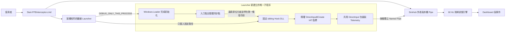

# FFB Interceptor 不改遊戲 DLL 啟動模式技術報告

> 分析日期：2026-08-29
> 報告類型：一般 PE／執行時架構分析（`flavor = null`，非惡意程式、APT 或漏洞報告）
> 授權與網路：擁有者本機、離線、只使用本專案自行建置的測試程式

## 1. 執行摘要

本次把既有 `dinput8.dll` proxy 的 DirectInput 包裝核心抽出，新增 x86／x64
`FFBInterceptor.Launcher.exe` 與固定同目錄 `FFBInterceptor.Hook.dll`。新模式不在遊戲
資料夾建立、覆寫、改名或刪除任何檔案；它只建立新的離線子程序，在第一條應用程式
指令執行前載入固定 Hook，還原暫時的記憶體同步位元組，再替換尚未被修改的
`dinput8.dll!DirectInput8Create` IAT 指標。

雙架構共 12 項 C++ 測試、兩個 owner-built 子程序端到端 smoke，以及隔離的 SimHub
安裝／竄改拒絕／解除安裝復原生命週期均通過。最終 ZIP 有 20 個 allowlist 檔案、沒有
`dinput8.dll`，大小為 436,268 bytes，SHA-256 為
`974A73F5E3BFA171AADC86ABC06997C6001BEBFCF2D088FDFDF083E69C2513EE`。
這不是反作弊繞過，也不代表商業遊戲或實體方向盤相容性已獲驗證。

## 2. 範圍與授權

Case：`20260829-ffb-launcher-hook`；權威 scope 位於本機
`reverse-skill/work/20260829-ffb-launcher-hook/scope.md`。

| 項目 | 範圍 |
|---|---|
| 授權依據 | `own_system`，使用者自己的原始碼與本機建置產物 |
| 網路設定 | `offline`，未掃描或連線任何外部目標 |
| 動態目標 | 只以各架構的 `FFBInterceptor.Launcher.exe` 啟動同一份 owner-built EXE |
| 封裝目標 | 系統暫存目錄內的 fake SimHub；不修改實際 SimHub 或遊戲 |
| 明確排除 | 第三方遊戲、既有 PID、任意 DLL、反作弊、線上競技、隱匿、提權與驅動層 |

## 3. 架構與呼叫路徑



可獨立編輯的 Mermaid 原始檔位於 [`launcher-mode.mmd`](launcher-mode.mmd)。

P-001（`path_type=callflow`）的實際順序如下：

1. Launcher 正規化本機 EXE，拒絕 UNC、Windows 目錄、位元數不符與過長路徑（E-004／F-001）。
2. 它以 `DEBUG_ONLY_THIS_PROCESS` 建立新 child，等待 loader 初始 breakpoint（E-002／F-001）。
3. 在 PE entry point 暫放 `INT3`；命中後先還原原 byte、重設 IP、明確 suspend main thread，再繼續 debug event，因此第一條應用程式指令尚未執行（E-002、E-004／F-001）。
4. Launcher 解析 child 內系統 `LoadLibraryW`，只載入同目錄固定 Hook，呼叫固定 initializer（E-002／F-001）。
5. Hook 載入 System32 `dinput8.dll`，只比較並替換原值仍為真實 `DirectInput8Create` 的 IAT slot；無法安全讀取的模組直接略過（E-001、E-004／F-001）。
6. Launcher 設定 debugger 結束時不殺 child、resume main thread 後退出；後續 DirectInput 呼叫進入共用 wrapper（E-002／F-001）。
7. Telemetry 經獨立 pipe 送到 SimHub，以既有 60 Hz 狀態引擎判定命令削峰（E-003／F-002）。

殘餘風險：未簽章程序內 Hook 可能被防護軟體阻擋；動態解析函式、私有 loader、下一層
child 或超過約 10.5 分鐘才載入的 DirectInput 模組可能無法攔截。

## 4. 靜態與動態分析

### 4.1 PE 與匯出面

| 元件 | x64 | x86 | 重要介面 |
|---|---|---|---|
| Launcher | machine `0x8664` | machine `0x014c` | 僅 `--offline-only --game <path> -- [args]` |
| Hook DLL | PE32+ DLL | PE32 DLL | x64 `FFBHookInitialize`；x86 `_FFBHookInitialize@4` |
| 傳統 proxy | PE32+／PE32 DLL | PE32／PE32+ 依架構 | `DirectInput8Create` 與標準 COM exports |

Launcher 原始碼沒有 PID 參數、DLL 路徑參數或 elevation 路徑。Hook 的模組巡覽固定排除自己，
模組被 pin 後才檢查 import；指標替換以 compare-exchange 完成，已被其他元件修改的 slot
不會覆蓋。MSVC build 另以 SEH 將不可讀／異常 PE page 轉成「略過該模組」，測試使用
`PAGE_NOACCESS` fixture 驗證不會讓 monitor thread 拖垮 child。

### 4.2 執行時同步與 handle 生命週期

除錯事件只主動關閉 Microsoft 文件要求 debugger 自行關閉的 `CREATE_PROCESS`／`LOAD_DLL`
`hFile`；事件提供的 process/thread handle 留給系統在對應 `EXIT_*` 事件完成後關閉。入口點
命中時不再先單步一條指令，而是還原、rewind、明確 suspend 後才繼續 debug event，消除
第一條指令若直接跳往 DirectInput import 時漏掉首次呼叫的窗口。

### 4.3 可攜安裝與復原

Launcher ZIP 只複製固定 allowlist。SimHub 安裝狀態使用 Common Application Data 下的
Administrators／SYSTEM 可寫、Users 唯讀 ACL；schema 恰好允許兩個固定檔名，並記錄安裝檔
與原始備份 SHA-256。解除安裝前會重新正規化目的地、拒絕 reparse point、重複項、越界
備份與任何 hash 變更。安裝狀態寫入失敗會回滾 DLL；解除安裝先把受管理檔 stage 起來，
任一步驟失敗都回滾，只有狀態成功移除後才清理 staged copy。

## 5. Evidence → Finding → Path

### 5.1 Evidence

| E-id | source_ref | 可重現命令摘要 | content_hash |
|---|---|---|---|
| E-001 | x64/x86 CMake + CTest | 建置所有 producer／tests，分別執行兩個 build 目錄的 CTest | n/a |
| E-002 | owner-built child smoke | 各架構 launcher 以自己為 `--game`，child 執行 `--help` | n/a |
| E-003 | 初始 launcher ZIP lifecycle | `Build-LauncherPackage.ps1` 與 `Test-LauncherPackage.ps1` | release-candidate artifact |
| E-004 | source/security review | 檢視 launcher、hook、IAT、portable scripts 與 `git diff --check` | n/a |
| E-005 | hardened package gate | 目錄碰撞、版本混用、state hash 與雙架構驗證 | release-candidate artifact |
| E-006 | final first-run UX artifact | 首次提示、完整 lifecycle 與 exact ZIP audit | ZIP SHA-256 `974A73…513EE` |

完整 Evidence 位於 case 的 `evidence/E-001.md` 至 `E-006.md`。

### 5.2 Findings

| F-id | severity | status | evidence_ids | confidence | location | 結論 |
|---|---|---|---|---|---|---|
| F-001 | n/a_re | validated | E-001, E-002, E-004 | high | `launcher/`, `src/hook_dll.cpp`, `src/iat_hook.cpp` | 新模式限制在自己新建的 child 與固定 sibling Hook，且在第一條指令前完成初始化，不需遊戲目錄 DLL |
| F-002 | info | validated | E-003, E-004 | high | `simhub/launcher-portable/`, `simhub/tools/` | ZIP 不含 `dinput8.dll`；固定 schema、hash、stage/rollback 與 exact manifest 讓 SimHub 外掛安裝可驗證復原 |
| F-003 | info | validated | E-001, E-004 | high | `src/iat_hook.cpp`, `docs/architecture.md` | 支援面只涵蓋標準 IAT `DirectInput8Create`；動態解析、私有 loader、下一層 child 與監看期限外載入明確排除 |

### 5.3 Path

P-001：`Start-FFBInterceptor.cmd` → 架構判斷 → 新 child loader → entry-point 記憶體同步 →
固定 Hook initializer → 精確 IAT replacement → 共用 DirectInput wrapper → 本機 pipe → SimHub
削峰引擎。每一步的 E/F 對應見第 3 節。

## 6. 第三方可重現步驟

在對應架構的 Visual Studio Developer Prompt 執行：

```powershell
cmake --build build\x64-release --target dinput8 ffb_hook ffb_launcher ffb_protocol_tests ffb_wrapper_tests ffb_dinput_wrapper_tests ffb_performance_tests ffb_telemetry_tests ffb_iat_hook_tests
ctest --test-dir build\x64-release --output-on-failure

cmake --build build\x86-release --target dinput8 ffb_hook ffb_launcher ffb_protocol_tests ffb_wrapper_tests ffb_dinput_wrapper_tests ffb_performance_tests ffb_telemetry_tests ffb_iat_hook_tests
ctest --test-dir build\x86-release --output-on-failure
```

使用 owner-built fixture 做安全端到端 smoke：

```powershell
$x64 = (Resolve-Path build\x64-release\FFBInterceptor.Launcher.exe).Path
& $x64 --offline-only --game $x64 -- --help

$x86 = (Resolve-Path build\x86-release\FFBInterceptor.Launcher.exe).Path
& $x86 --offline-only --game $x86 -- --help
```

建立並複驗 ZIP：

```powershell
powershell.exe -NoProfile -ExecutionPolicy Bypass -File simhub\tools\Build-LauncherPackage.ps1
powershell.exe -NoProfile -ExecutionPolicy Bypass -File simhub\tools\Test-LauncherPackage.ps1 `
  -PackagePath simhub\dist\FFBInterceptor-Launcher-0.2.0.zip
Get-FileHash simhub\dist\FFBInterceptor-Launcher-0.2.0.zip -Algorithm SHA256
```

## 7. 驗證環境與結果

| 項目 | 結果 |
|---|---|
| OS／架構 | Windows，x64 host；x64 與 WOW64 x86 target |
| 編譯器 | Visual Studio 18 Community，MSVC 14.51.36231，Windows SDK 10.0.26100.0 |
| CMake | 4.4.0 |
| PowerShell | Windows PowerShell 5.1.26100.9168 |
| .NET SDK | 10.0.400；SimHub core／adapter 目標 net48 |
| C++ tests | x64 6/6、x86 6/6 |
| SimHub core | 29/29 |
| Dashboard schema | 2/2 |
| 子程序 smoke | x64、x86 各通過 |
| ZIP lifecycle | 安裝、冪等重跑、tamper refusal、原檔復原通過 |
| ZIP | 435,203 bytes；20 files；`dinput8.dll` entries = 0 |

## 8. 限制與使用建議

- 僅供離線／單機；`--offline-only` 是明確確認，不是技術斷網。
- 不對反作弊、受保護程序、線上遊戲、任意 PID/DLL 或管理員權限 target 提供支援。
- 未簽章 ZIP 與程序內 Hook 可能觸發 SmartScreen／防毒；使用者應先核對 SHA-256，不應關閉防護硬闖。
- 實際遊戲可能透過另一個 launcher、動態函式解析或其他 FFB API，這些情況不保證有資料。
- 削峰只代表 DirectInput 命令接近 `DI_FFNOMINALMAX`，不是馬達扭力；高扭力硬體仍需實體急停與最低 gain 測試。
- 本次沒有執行第三方遊戲或實體硬體測試，因此不提出相容性或安全認證聲明。

## 9. Timeline 摘要

1. 建立 owner-operated offline scope，完成既有 proxy PE triage。
2. 抽出共用攔截核心，實作 fixed-sibling launcher/hook 與 bounded IAT parser。
3. 審查時修正 debug-event handle 所有權、嚴格 pre-entry 同步與不可讀 PE page fail-closed。
4. 通過雙架構 CTest 與 owner-built child smoke。
5. 完成 exact-allowlist ZIP、受保護狀態、transactional install/uninstall 與隔離生命週期測試。
6. 產出本報告、Mermaid 呼叫路徑與繁體中文即開即用說明。
